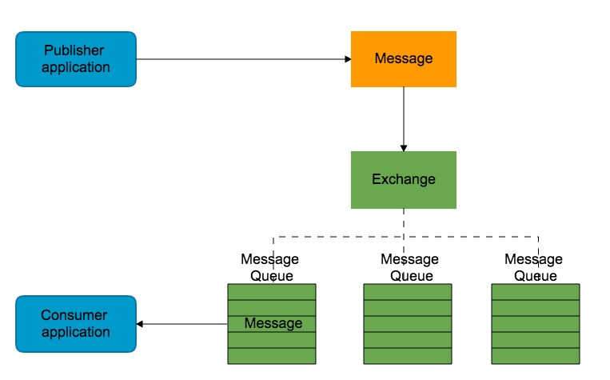

# RABBITMQ

## 基础概念

### AMQP协议

 AMQP，即Advanced Message Queuing Protocol,一个提供统一消息服务的应用层标准高级消息队列协议，是应用层协议的一个开放标准,为面向消息的中间件设计。基于此协议的客户端与消息中间件可传递消息，并不受客户端/中间件同产品，不同的开发语言等条件的限制。

 AMQ 作为中间层服务，把消息生产和消费分隔开来，当消息生产者出现异常，不影响消费者对消息的消费，当消费者异常时，生产者生产的消息可以存放到服务的内存或者磁盘，不会影响到消费的速率，同时，消息也可以基于路由的规则可以投递到指定的消费者消费。

 AMQ 基于模块化通过 Exchange 和 Message Queue 两个组建组合实现消息路由分发：

Exchange：

基于消息生产者和路由规则可以将消息投递到指定的 Message Queue；

Message Queue：

能够将发送过来的消息进行存储，同时将消息转发给消费者；

 Exchange 和 Message Queue之间存在绑定关系，消息到了 Exchange 后基于路由策略可以将消息投递到已绑定且符合路由策略的 Message Queue。

### rabbitmq基本概念

- **Broker**: 接收和分发消息的应用，RabbitMQ Server就是Message Broker。
- **Virtual host**: 出于多租户和安全因素设计的，把AMQP的基本组件划分到一个虚拟的分组中，类似于网络中的namespace概念。当多个不同的用户使用同一个RabbitMQ server提供的服务时，可以划分出多个vhost，每个用户在自己的vhost创建exchange／queue等。
- **Connection**: publisher／consumer和broker之间的TCP连接。断开连接的操作只会在client端进行，Broker不会断开连接，除非出现网络故障或broker服务出现问题。
- **Channel**: 如果每一次访问RabbitMQ都建立一个Connection，在消息量大的时候建立TCP Connection的开销将是巨大的，效率也较低。Channel是在connection内部建立的逻辑连接，如果应用程序支持多线程，通常每个thread创建单独的channel进行通讯，AMQP method包含了channel id帮助客户端和message broker识别channel，所以channel之间是完全隔离的。Channel作为轻量级的Connection极大减少了操作系统建立TCP connection的开销。
- **Exchange**: message到达broker的第一站，根据分发规则，匹配查询表中的routing key，分发消息到queue中去。常用的类型有：direct (point-to-point), topic (publish-subscribe) and fanout (multicast)。
- **Queue**: 消息最终被送到这里等待consumer取走。一个message可以被同时拷贝到多个queue中。
- **Binding**: exchange和queue之间的虚拟连接，binding中可以包含routing key。Binding信息被保存到exchange中的查询表中，用于message的分发依据